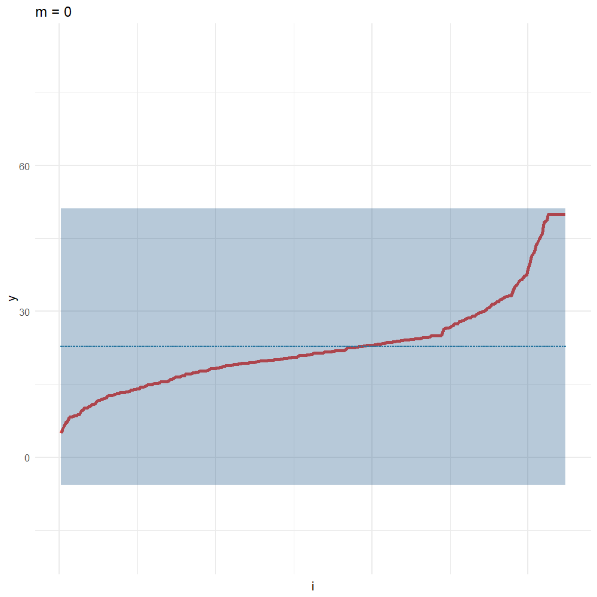

# XGBoost-Distribution-Estimation-Model


依據XGBoost的框架實作一個可以預測樣本分配估計的模型，以更好的捕捉資料的不確定性。

## Implementation
將XGBoost的迴歸樹 Loss function 更改為最大概似法估計(Maximum Likelihood Estimation)進行梯度下降如下所示。
將$L(y)$變更為$-logP(y)$。 其中$P(y)$以常態分配(Normal distribution)之p.d.f為例。
<p align="center">

</p>
<p align="center">
</p>

參考[Ngboost(2019)](https://github.com/stanfordmlgroup/ngboost)所使用之Fisher information metric，以正確計算每個參數之梯度。
<p align="center">

</p>
<p align="center">

</p>
經整理後設計兩個不同的XGBoost Decision Tree 模型$\large f_{\mu}(x)、 f_{t}(x)$以分別預測常態分佈的兩個參數，其中之$\large g、h$值如以下所示：
<p align="center">

</p>
<p align="center">

</p>


## Verification

- 收斂情形

  可以針對估計不同的樣本得到不同的估計區間。

  - 

## Installation

```R
install.packages("xgboost")
```


## Usage

```R
    MuLoss <- function(preds, dtrain, sig = f_sigma.predict) {
      labels <- getinfo(dtrain, "label")
      preds <- preds
      grad <- -((labels - preds)/(1+(exp(2*sig)*0.00001)))
      hess <- (labels - labels + 1)
      return(list(grad = grad, hess = hess))
    }


    SigmaLoss <- function(preds, dtrain, mu = f_mu.predict) {
      labels <- getinfo(dtrain, "label")
      preds <- preds
      grad <- -((((labels - mu)^2)/(2 * exp(2 * preds))) - 0.5)
      hess <-(labels - labels + 1)
      return(list(grad = grad, hess = hess))
    }

model = CustomXgb(trainData = trainData,
                    col = col,
                    iter_rounds = iter_rounds,
                    label =  trainData$y,
                    valData = valData, 
                    valLabel = valData$y)
```


詳細使用方法可以參考`src/walkthrough.R`
